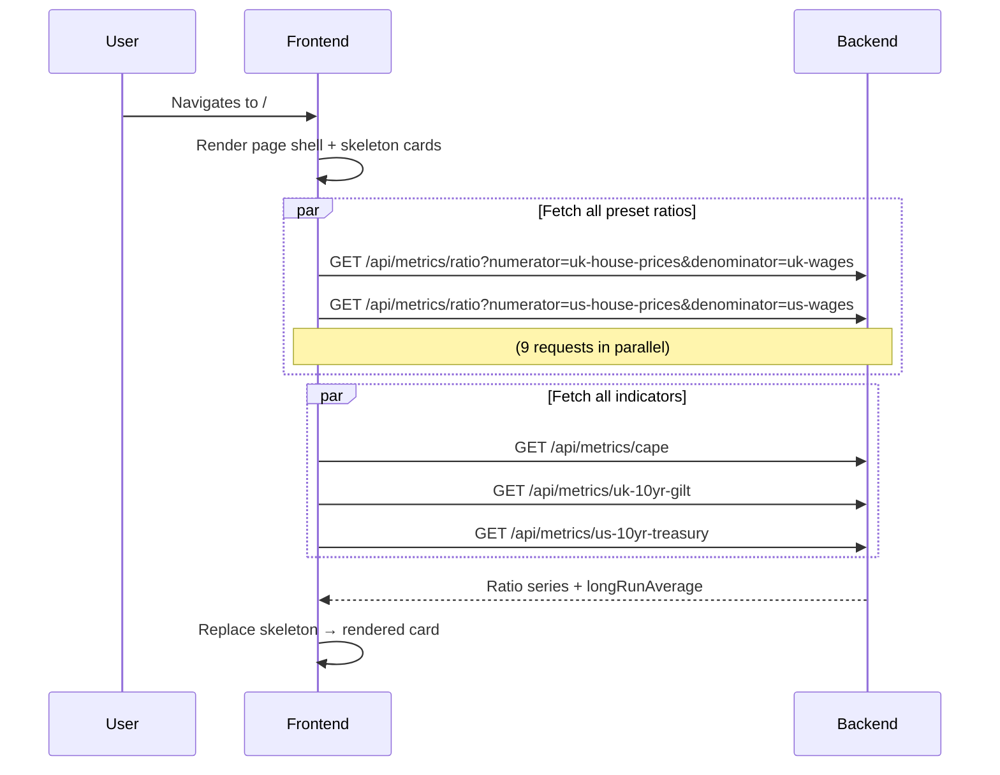
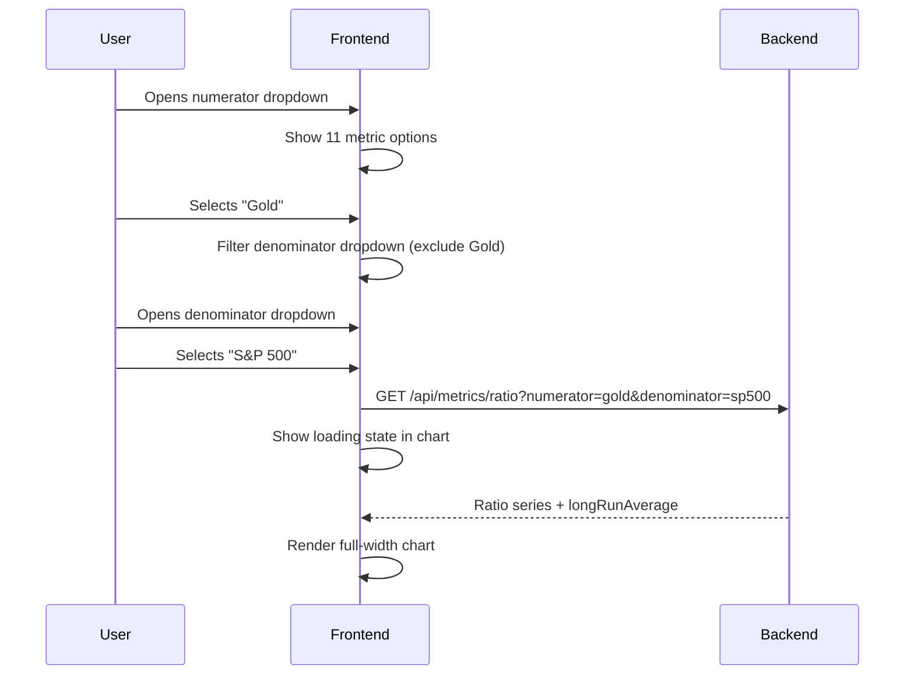
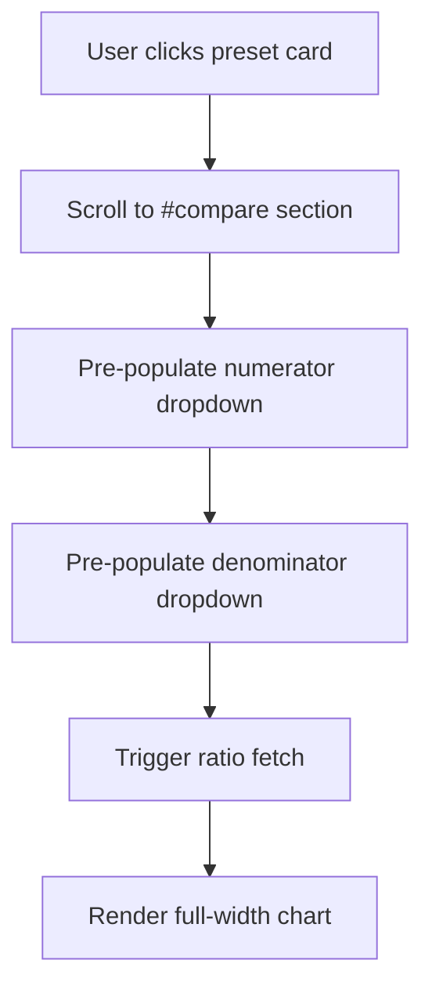
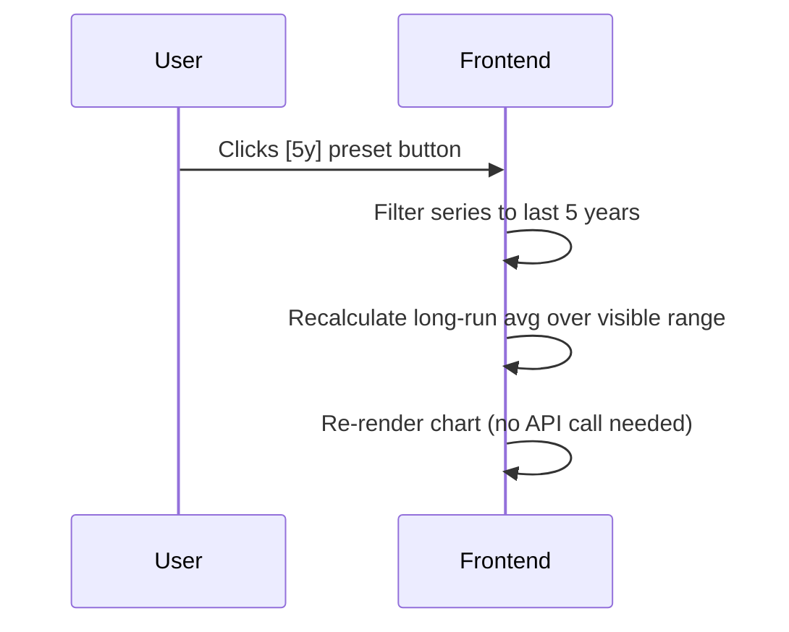

# MacroMetrics — Homepage Design

> Phase 2 UI/UX design. Closes #18, #19, #20, #21, #22, #23, #24.

---

## Agreed decisions (from issue discussions)

| Decision | Resolution |
|---|---|
| Date range presets | 1y / 2y / 5y / 10y / 20y / Max — default **Max** |
| Colour scheme | Single neutral colour for MVP. Warm/cool deferred → #26 |
| Chart size modes | One `RatioChart` component, two modes: `compact` (preset cards) and `full` (custom comparison) |
| Preset grid layout | 3-column responsive, cards show headline stat + compact chart |
| Card expand | No expand for MVP — clicking a card pre-populates the custom comparison picker |
| Preset ordering | By theme: Affordability → Inflation-adjusted → Cross-asset |
| Metric picker | Two dropdowns + ⇄ swap button |
| Custom comparison position | Distinct section below presets with heading + visual divider |
| Indicator card dimensions | Narrower than ratio cards (~1/3 width), 3-card row |
| Indicator sparkline | Shows long-run average as dashed reference line |
| Indicator visual style | Muted/distinct from ratio cards — supporting context, not primary |
| Bond yield curve | Post-MVP → #26. MVP shows 10yr yield only. |
| Page navigation | Single-scroll with sticky mini-nav anchors |

---

## Page layout — full homepage (desktop)

```
┌──────────────────────────────────────────────────────────────────┐
│  MacroMetrics                                                    │
│  Real value. Long view.                             [sticky nav] │
├──────────────────────────────────────────────────────────────────┤
│  ┌─ Presets ─────────────────────────────────────────────────┐  │
│  │  Compare / Indicators                                      │  │  ← Sticky mini-nav (anchors)
│  └────────────────────────────────────────────────────────────┘  │
├──────────────────────────────────────────────────────────────────┤
│  Preset Comparisons                              #presets anchor │
│                                                                  │
│  ┌──────────────┐  ┌──────────────┐  ┌──────────────┐          │
│  │UK Affordab.  │  │US Affordab.  │  │UK Real HPI   │          │
│  │ 8.3×         │  │ 7.1×         │  │ 142          │          │
│  │ ▲ 42% avg    │  │ ▲ 38% avg    │  │ ▲ 31% avg    │          │
│  │  ╭──╮  ╭─╮  │  │  ╭──╮  ╭─╮  │  │  ╭──╮  ╭─╮  │          │
│  │ ─╯  ╰──╯ ╰  │  │ ─╯  ╰──╯ ╰  │  │ ─╯  ╰──╯ ╰  │          │
│  │ - - avg- - - │  │ - - avg- - - │  │ - - avg- - - │          │
│  └──────────────┘  └──────────────┘  └──────────────┘          │
│                                                                  │
│  ┌──────────────┐  ┌──────────────┐  ┌──────────────┐          │
│  │Real Gold     │  │Gold vs Eq.   │  │Real S&P 500  │          │
│  │ ...          │  │ ...          │  │ ...          │          │
│  └──────────────┘  └──────────────┘  └──────────────┘          │
│                                                                  │
│  ┌──────────────┐  ┌──────────────┐  ┌──────────────┐          │
│  │UK Prop/Gold  │  │Real Oil      │  │BTC vs Gold   │          │
│  │ ...          │  │ ...          │  │ ...          │          │
│  └──────────────┘  └──────────────┘  └──────────────┘          │
│                                                                  │
├──────────────────────────────────────────────────────────────────┤
│  Build your own comparison                      #compare anchor  │
│                                                                  │
│  [UK House Prices      ▼]   ⇄   [UK Wages             ▼]       │
│                                                                  │
│  ┌────────────────────────────────────────────────────────────┐ │
│  │  UK House Prices / UK Wages                                │ │
│  │                                           ╭╮               │ │
│  │                              ╭─╮    ╭────╯╰──╮            │ │
│  │  ╭╮  ╭─╮             ╭─────╯  ╰────╯        ╰─           │ │
│  │ ─╯╰──╯ ╰─────────────╯                                    │ │
│  │ - - - - - - avg - - - - - - - - - - - - - - - - - -       │ │
│  └────────────────────────────────────────────────────────────┘ │
│  [1y]  [2y]  [5y]  [10y]  [20y]  [Max✓]                        │
│                                                                  │
├──────────────────────────────────────────────────────────────────┤
│  Indicators                                  #indicators anchor  │
│                                                                  │
│  ┌───────────────┐   ┌───────────────┐   ┌───────────────┐      │
│  │ CAPE Ratio    │   │ UK 10yr Gilt  │   │ US 10yr Tsy   │      │
│  │ 32.4×         │   │ 4.6%          │   │ 4.3%          │      │
│  │ +90% above    │   │ +12% above    │   │ +8% above     │      │
│  │ long-run avg  │   │ long-run avg  │   │ long-run avg  │      │
│  │ ▁▂▄▅▇█▇▅▄▂   │   │ ▃▅▇█▆▄▃▂▁▂   │   │ ▂▄▆█▇▅▄▃▂▁   │      │
│  │ - -avg- -     │   │ - -avg- -     │   │ - -avg- -     │      │
│  └───────────────┘   └───────────────┘   └───────────────┘      │
│                                                                  │
└──────────────────────────────────────────────────────────────────┘
```

---

## Preset ratio card — states

### Default (loaded)
```
┌──────────────────────┐
│ UK Affordability     │
│ 8.3×  ▲ 42% avg      │
│  ╭──╮      ╭─╮       │
│ ─╯  ╰──────╯ ╰─      │
│ - - - avg - - - -    │
│ Max ▾  1990–2026      │
└──────────────────────┘
```

### Loading
```
┌──────────────────────┐
│ UK Affordability     │
│ ░░░░  ░░░░░░░        │  ← skeleton shimmer
│  ░░░░░░░░░░░░░░      │
│  ░░░░░░░░░░░░░░      │
│  ░░░░░░░░░░░░░░      │
└──────────────────────┘
```

### Error
```
┌──────────────────────┐
│ UK Affordability     │
│ ⚠ Could not load     │
│   data. Retry?       │
│   [Try again]        │
└──────────────────────┘
```

---

## Ratio chart component — states

### Compact mode (inside preset card)
```
│  ╭──╮      ╭─╮       │  ← ratio line
│ ─╯  ╰──────╯ ╰─      │
│ - - - avg - - - -    │  ← dashed long-run avg
│ [1y][2y][5y][10y][20y][Max]
```
Height: ~160px. No axis labels. Tooltip on hover.

### Full mode (custom comparison section)
```
┌────────────────────────────────────────────────────────────┐
│  UK House Prices / UK Wages                      8.3×  ▲42%│
│                                           ╭╮               │
│ 10 ─                         ╭─╮    ╭────╯╰──╮            │
│  8 ─         ╭╮  ╭─╮   ╭───╯  ╰────╯        ╰─           │
│  6 ─ ╭╮  ╭─╮╯╰──╯ ╰───╯                                  │
│  4 ─╯╰──╯                                                  │
│     ──────────────────────────── avg (5.2×) ────────       │
│ 1990      2000      2010      2020      2026                │
│ [1y]  [2y]  [5y]  [10y]  [20y]  [Max✓]                    │
└────────────────────────────────────────────────────────────┘
```
Height: ~320px. Y-axis labels shown. Date axis shown.

### Tooltip (both modes)
```
│  ┌─────────────────┐  │
│  │ Jan 2007        │  │
│  │ 8.9×            │  │
│  │ ▲ 71% above avg │  │
│  └─────────────────┘  │
```

---

## Metric picker — states

### Empty (no selection)
```
[Select numerator   ▼]   ⇄   [Select denominator ▼]
─────────────────────────────────────────────────────
  Select two metrics above to see a custom comparison
```

### Numerator selected, waiting for denominator
```
[UK House Prices    ▼]   ⇄   [Select denominator ▼]
─────────────────────────────────────────────────────
  Now select a denominator
```

### Both selected (chart visible)
```
[UK House Prices    ▼]   ⇄   [UK Wages           ▼]
[chart rendered below]
```

### Dropdown open
```
[UK House Prices    ▼]   ⇄   [UK Wages           ▼]
 ┌────────────────────┐
 │ UK House Prices  ✓ │
 │ US House Prices    │
 │ UK Wages           │
 │ US Wages           │
 │ UK CPI             │
 │ US CPI             │
 │ Gold               │
 │ Oil                │
 │ FTSE 100           │
 │ S&P 500            │
 │ Bitcoin            │
 └────────────────────┘
```

Note: the selected numerator is excluded from the denominator dropdown and vice versa.

---

## Indicator card — states

### Default (loaded)
```
┌─────────────────┐
│ CAPE Ratio      │
│ 32.4×           │
│ +90% above      │
│ long-run avg    │
│ ▁▂▄▅▇█▇▅▄▂     │
│ - - avg(17×) -  │
└─────────────────┘
```

### Loading
```
┌─────────────────┐
│ CAPE Ratio      │
│ ░░░░            │
│ ░░░░░░░░░       │
│ ░░░░░░░░░░░░░   │
└─────────────────┘
```

### Error
```
┌─────────────────┐
│ CAPE Ratio      │
│ ⚠ Unavailable   │
└─────────────────┘
```

---

## Mermaid workflow diagrams

### User views the homepage


### User selects a custom comparison


### User clicks a preset card


### User changes date range


Note: date range filtering is client-side — full series fetched once on load.

---

## UX questions — all resolved

| Issue | Question | Resolution |
|---|---|---|
| #18 | Sections above the fold | Heading + first row of 3 preset cards |
| #18 | Single-scroll vs nav anchors | Single-scroll with sticky mini-nav anchors |
| #19 | Date range selector | Preset buttons: 1y/2y/5y/10y/20y/Max, default Max |
| #19 | Colour scheme | Deferred → #26. Single neutral colour for MVP. |
| #19 | Compact vs full-width | One component, `compact` / `full` size modes |
| #20 | Grid layout | 3-column responsive |
| #20 | Card content | Headline stat + compact chart |
| #20 | Expandable cards | No — click pre-populates custom comparison |
| #20 | Ordering | Affordability → Inflation-adjusted → Cross-asset |
| #21 | Picker style | Two dropdowns |
| #21 | Swap button | Yes — ⇄ between dropdowns |
| #21 | Page position | Below presets, distinct section with divider |
| #22 | Chart size | Full-width |
| #22 | Visual separation | Yes — heading + horizontal rule |
| #23 | Card dimensions | Narrower (~1/3 width), 3-card row |
| #23 | Sparkline reference line | Yes — dashed long-run average |
| #24 | Visual style | Muted/distinct from ratio cards |
| #24 | Bond yield curve | Post-MVP → #26 |
