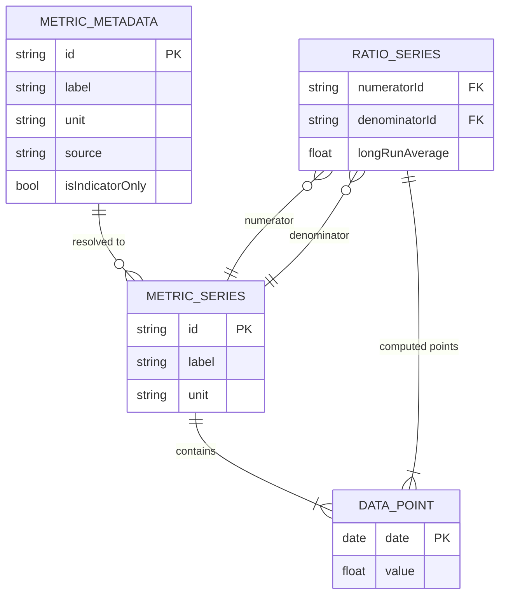

# Backend Design Spec — MacroMetrics Phase 5

> **Status:** Proposed — awaiting developer review and merge.
> **Triggers:** All `[4]` frontend issues closed.
> **References:** `docs/specs/backend-architecture.md`, `docs/specs/backend-srp.md`, `docs/specs/testing-strategy.md`

---

## 1. Scope

This document covers the full backend design for the MacroMetrics MVP data layer. The backend is a **stateless proxy** — no database is required. It fetches time-series data from three public data sources, normalises series to a common cadence, and exposes them to the frontend via three REST endpoints.

---

## 2. API Contract

The three endpoints the frontend requires (as described in `docs/backlog/phase5-metrics-api.md`):

| Method | Path | Description |
|--------|------|-------------|
| `GET` | `/api/metrics` | List all available metrics and their metadata |
| `GET` | `/api/metrics/{id}` | Return a full time series for a specific metric |
| `GET` | `/api/metrics/ratio` | Compute and return a ratio series for two metrics |

### 2.1 Query Parameters

**`GET /api/metrics/ratio`**

| Parameter | Type | Required | Description |
|-----------|------|----------|-------------|
| `numerator` | `string` | Yes | Metric ID for the numerator |
| `denominator` | `string` | Yes | Metric ID for the denominator |
| `from` | `string` (ISO date) | No | Start of date range (default: earliest available) |
| `to` | `string` (ISO date) | No | End of date range (default: latest available) |

**`GET /api/metrics/{id}`**

| Parameter | Type | Required | Description |
|-----------|------|----------|-------------|
| `from` | `string` (ISO date) | No | Start of date range |
| `to` | `string` (ISO date) | No | End of date range |

### 2.2 Response Shapes

**`GET /api/metrics` → `MetricMetadata[]`**
```json
[
  {
    "id": "uk-house-prices",
    "label": "UK House Prices",
    "unit": "Index (£)",
    "source": "ONS HPI",
    "isIndicatorOnly": false
  },
  {
    "id": "cape",
    "label": "Shiller CAPE Ratio",
    "unit": "Ratio",
    "source": "FRED",
    "isIndicatorOnly": true
  }
]
```

**`GET /api/metrics/{id}` → `MetricSeries`**
```json
{
  "id": "uk-house-prices",
  "label": "UK House Prices",
  "unit": "Index (£)",
  "points": [
    { "date": "2000-01-31", "value": 100.0 },
    { "date": "2000-02-29", "value": 101.3 }
  ]
}
```

**`GET /api/metrics/ratio` → `RatioSeries`**
```json
{
  "numeratorId": "uk-house-prices",
  "denominatorId": "uk-wages",
  "points": [
    { "date": "2000-01-31", "value": 4.52 },
    { "date": "2000-02-29", "value": 4.58 }
  ],
  "longRunAverage": 5.1
}
```

### 2.3 ADR-001: Server-side date filtering

Date range filtering is applied server-side (not delegated to the client). This keeps response payloads bounded and avoids sending decades of data when the user only needs 5 years. The full series is fetched from the source and then sliced before serialisation.

---

## 3. Data Model Relationships (ER Diagram)

Although there is no database for MVP, the domain entities have well-defined relationships. The diagram below uses ER notation to show the conceptual data model.



---

## 4. Entity and Relationship Definitions

### 4.1 `MetricMetadata`
Describes a single available metric. Returned by `GET /api/metrics`.

| Field | Type | Notes |
|-------|------|-------|
| `Id` | `string` | Kebab-case identifier (e.g. `uk-house-prices`) |
| `Label` | `string` | Display name (e.g. "UK House Prices") |
| `Unit` | `string` | Unit of measurement (e.g. "Index (£)", "$/oz") |
| `Source` | `string` | Data source name (e.g. "ONS HPI", "FRED", "yfinance") |
| `IsIndicatorOnly` | `bool` | `true` for CAPE, gilt yield, treasury yield — not usable as ratio numerator/denominator |

### 4.2 `DataPoint`
A single timestamped value on a time series.

| Field | Type | Notes |
|-------|------|-------|
| `Date` | `DateOnly` | End-of-month date after normalisation |
| `Value` | `double` | Normalised value in the metric's unit |

### 4.3 `MetricSeries`
A full or date-filtered time series for one metric.

| Field | Type | Notes |
|-------|------|-------|
| `Id` | `string` | Matches `MetricMetadata.Id` |
| `Label` | `string` | Display name |
| `Unit` | `string` | Unit of measurement |
| `Points` | `DataPoint[]` | Chronologically ordered, monthly cadence |

### 4.4 `RatioSeries`
The result of dividing one `MetricSeries` by another, point-by-point, over the intersection of their date ranges.

| Field | Type | Notes |
|-------|------|-------|
| `NumeratorId` | `string` | References `MetricMetadata.Id` |
| `DenominatorId` | `string` | References `MetricMetadata.Id` |
| `Points` | `DataPoint[]` | Ratio values: numerator ÷ denominator |
| `LongRunAverage` | `double` | Mean of all `Points.Value` over the full available history |

---

## 5. Service Layer Outline

All services follow the SRP as defined in `docs/specs/backend-srp.md`. Complex workflows are expressed as orchestrator methods.

### 5.1 Project Structure

```
MacroMetrics.Services/
├── Metrics/
│   ├── MetricCatalogueService.cs      # Returns the static catalogue of all 14 metrics
│   ├── MetricSeriesOrchestrator.cs    # Orchestrates: fetch → normalise → filter for one metric
│   └── RatioSeriesOrchestrator.cs     # Orchestrates: two series → compute ratio → compute average
├── Fetchers/
│   ├── YFinanceFetcherService.cs      # Fetches from yfinance via Python sidecar HTTP call
│   ├── FredFetcherService.cs          # Fetches from FRED REST API via HttpClient
│   └── OnsFetcherService.cs           # Fetches from ONS REST API via HttpClient
├── Normalisation/
│   └── DataNormalisationService.cs    # Aligns any cadence series to monthly end-of-month
└── Computation/
    ├── RatioComputationService.cs     # Divides two aligned series point-by-point
    └── LongRunAverageService.cs       # Computes the arithmetic mean of a series
```

### 5.2 Interfaces (in `MacroMetrics.Abstractions/Services/`)

Following the same folder grouping as the implementations:

```
MacroMetrics.Abstractions/Services/
├── Metrics/
│   ├── IMetricCatalogueService.cs
│   ├── IMetricSeriesOrchestrator.cs
│   └── IRatioSeriesOrchestrator.cs
├── Fetchers/
│   ├── IYFinanceFetcherService.cs
│   ├── IFredFetcherService.cs
│   └── IOnsFetcherService.cs
├── Normalisation/
│   └── IDataNormalisationService.cs
└── Computation/
    ├── IRatioComputationService.cs
    └── ILongRunAverageService.cs
```

### 5.3 Orchestrator Sketches

**`MetricSeriesOrchestrator.GetSeriesAsync`** (single metric)
```
1. IMetricCatalogueService.GetMetadata(id)        → MetricMetadata
2. IFetcher[source].FetchRawAsync(id)              → RawSeriesData
3. IDataNormalisationService.NormaliseAsync(raw)   → DomainMetricSeries
4. Apply date filter if from/to provided
5. Return DomainMetricSeries
```

**`RatioSeriesOrchestrator.GetRatioAsync`** (two metrics)
```
1. IMetricSeriesOrchestrator.GetSeriesAsync(numeratorId)
2. IMetricSeriesOrchestrator.GetSeriesAsync(denominatorId)
3. IRatioComputationService.Compute(numerator, denominator) → aligned ratio points
4. ILongRunAverageService.Compute(fullHistoryPoints)        → longRunAverage
5. Apply date filter to ratio points if from/to provided
6. Return DomainRatioSeries
```

> **Note:** Long-run average is always computed from the full available history (before date-range filtering), so the reference line remains stable regardless of the user's selected date range.

### 5.4 Fetcher Responsibility Split

Each fetcher owns exactly the metrics it knows about. The metric catalogue maps each `MetricId` to the correct fetcher.

| Fetcher | Metrics |
|---------|---------|
| `YFinanceFetcherService` | `gold`, `oil`, `ftse100`, `sp500`, `bitcoin`, `uk-10yr-gilt` |
| `FredFetcherService` | `us-house-prices`, `us-wages`, `us-cpi`, `cape`, `us-10yr-treasury` |
| `OnsFetcherService` | `uk-house-prices`, `uk-wages`, `uk-cpi` |

---

## 6. ADR Notes

### ADR-001: No database for MVP
**Decision:** The backend is a stateless proxy. No EF Core, no PostgreSQL, no `MacroMetrics.EntityModels` entries for metrics data.
**Rationale:** All 14 metrics are served from external public APIs. Caching is in-memory. Persisting to a database adds complexity with no user benefit for MVP.
**Consequences:** `MacroMetrics.Database` and `MacroMetrics.EntityModels` projects exist in the skeleton but are unused by metrics logic. They remain available for post-MVP features (e.g. saved views, user accounts).

### ADR-002: yfinance via Python sidecar
**Decision:** yfinance is a Python library. Rather than a subprocess exec or an unofficial .NET wrapper, the recommended approach is a minimal Python FastAPI sidecar that exposes yfinance data over HTTP.
**Rationale:** Subprocess calls are fragile and hard to test. A sidecar keeps the .NET code clean and lets the fetcher be a standard `HttpClient` call — the same pattern as FRED and ONS.
**Consequences:** Deployment requires a second container. The sidecar is an internal service (not publicly exposed). `IYFinanceFetcherService` calls it via a configured base URL — testable by mocking the HTTP gateway.
**Open question for Phase 6:** Define sidecar API contract (`GET /series/{ticker}?from=&to=`).

### ADR-003: In-memory caching (1-hour TTL)
**Decision:** `IMemoryCache` with a 1-hour TTL per metric series, keyed by metric ID.
**Rationale:** External APIs are slow. Caching at the service level (in `MetricSeriesOrchestrator`) prevents redundant fetches on every frontend request. Daily/weekly data does not change within an hour.
**Consequences:** Cache is per-pod (not shared). Acceptable for MVP (single replica). Post-MVP: consider Redis for multi-replica deployments.

### ADR-004: Monthly end-of-month normalisation cadence
**Decision:** All series are normalised to monthly cadence with end-of-month dates (e.g. `2024-01-31`).
**Rationale:** The lowest common cadence across all sources is monthly (ONS wages data). Daily series (yfinance) are downsampled by taking the last trading value of each calendar month. Monthly series (FRED, ONS) are aligned to end-of-month.
**Consequences:** Intra-month precision is lost for daily sources. Acceptable for the macro valuation use case where users compare multi-year trends.

### ADR-005: `isIndicatorOnly` flag for standalone metrics
**Decision:** CAPE, UK 10yr Gilt yield, and US 10yr Treasury yield are flagged `isIndicatorOnly: true` in the catalogue.
**Rationale:** These metrics are displayed as standalone indicator cards (not ratio charts). They should not be offered as options in the custom comparison metric picker.
**Consequences:** The frontend uses this flag to filter available metrics in the ratio picker UI.

---

## 7. In-Process Integration Test Scenarios

These scenarios are defined now (Phase 5), before any implementation. The actual test code is deferred to Phase 6, once the service dependency tree is built.

### Scenario 1 — Metric catalogue returns all 14 metrics
```
Given the application starts
When GET /api/metrics is called
Then the response contains exactly 14 entries
And each entry has a non-empty id, label, unit, and source
And "cape", "uk-10yr-gilt", "us-10yr-treasury" have isIndicatorOnly = true
```

### Scenario 2 — Single metric series returns normalised monthly data
```
Given yfinance sidecar returns raw daily data for "gold"
When GET /api/metrics/gold is called
Then the response contains a MetricSeries with monthly end-of-month DataPoints
And no two DataPoints share the same month
And all dates are end-of-month
```

### Scenario 3 — Ratio series computes correct values and long-run average
```
Given IFredFetcherService returns aligned monthly data for "us-house-prices" and "us-wages"
When GET /api/metrics/ratio?numerator=us-house-prices&denominator=us-wages is called
Then each ratio DataPoint.Value equals numerator.Value ÷ denominator.Value for that date
And longRunAverage equals the arithmetic mean of all ratio values in the full history
```

### Scenario 4 — Ratio series date filter does not affect long-run average
```
Given a ratio series with 20 years of history
When GET /api/metrics/ratio?numerator=gold&denominator=us-wages&from=2020-01-01 is called
Then the response DataPoints only cover 2020-01-01 onwards
And longRunAverage is still computed from the full 20-year history (not just the filtered range)
```

### Scenario 5 — Unknown metric ID returns 404
```
Given no metric exists with id "not-a-metric"
When GET /api/metrics/not-a-metric is called
Then the response status is 404
```

### Scenario 6 — Indicator-only metric requested as ratio numerator returns 400
```
Given "cape" is flagged isIndicatorOnly = true
When GET /api/metrics/ratio?numerator=cape&denominator=us-wages is called
Then the response status is 400
And the error message indicates "cape" is an indicator-only metric
```

### Scenario 7 — ONS fetcher is called for UK metrics
```
Given real ONS and FRED fetcher implementations are wired
When MetricSeriesOrchestrator.GetSeriesAsync("uk-house-prices") is called
Then IOnsFetcherService.FetchRawAsync is invoked
And IFredFetcherService.FetchRawAsync is not invoked
```

---

## 8. Route Registration (WebApi)

Three route groups to add to `MacroMetrics.WebApi/Routes/`:

```
Routes/
├── StatusRoutes.cs       # existing
└── MetricsRoutes.cs      # new — maps /api/metrics, /api/metrics/{id}, /api/metrics/ratio
```

Registered in `Program.cs`:
```csharp
app.MapGroup("/api")
    .MapStatusRoutes()
    .MapMetricsRoutes()
    .WithOpenApi();
```

---

## 9. Open Questions for Phase 6

| # | Question | Decision needed by |
|---|----------|--------------------|
| 1 | yfinance sidecar API contract — define `GET /series/{ticker}` shape | Phase 6 start |
| 2 | FRED API key storage — `appsettings.json` or environment variable secret? | Phase 6 start |
| 3 | Gap-filling strategy for missing monthly data points (forward-fill vs drop)? | Phase 6 implementation |
| 4 | Minimum shared history across all sources — earliest reliable date for each fetcher? | Phase 6 implementation |
| 5 | Cache invalidation — time-based only, or manual flush endpoint? | Phase 6 |
| 6 | Response caching headers (`Cache-Control`) for downstream CDN/browser caching? | Phase 6 |
